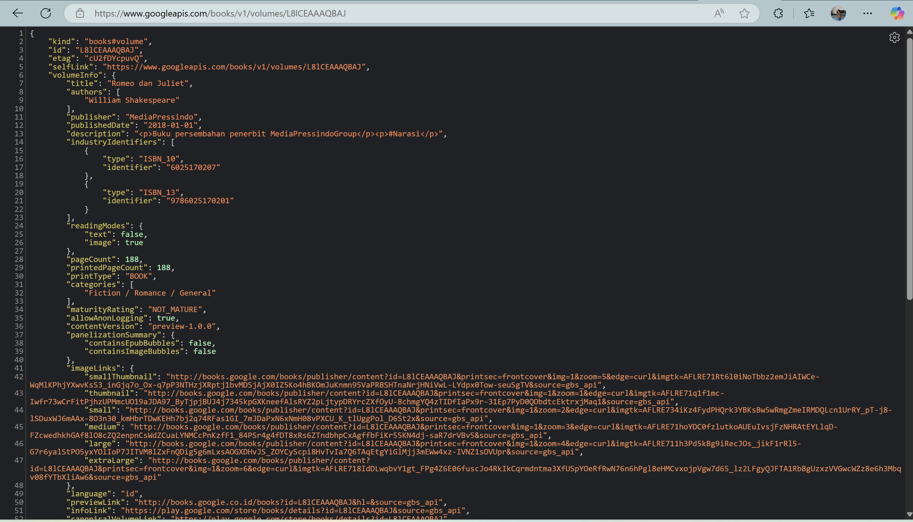
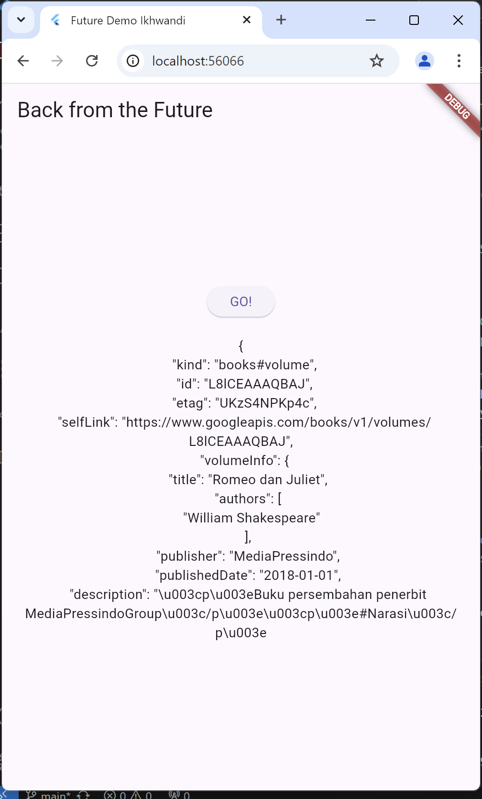
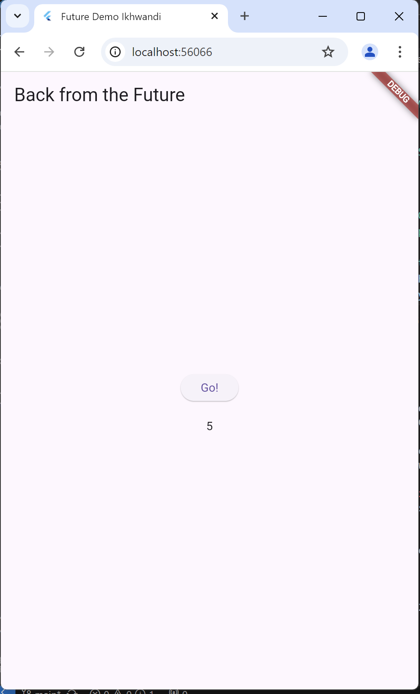
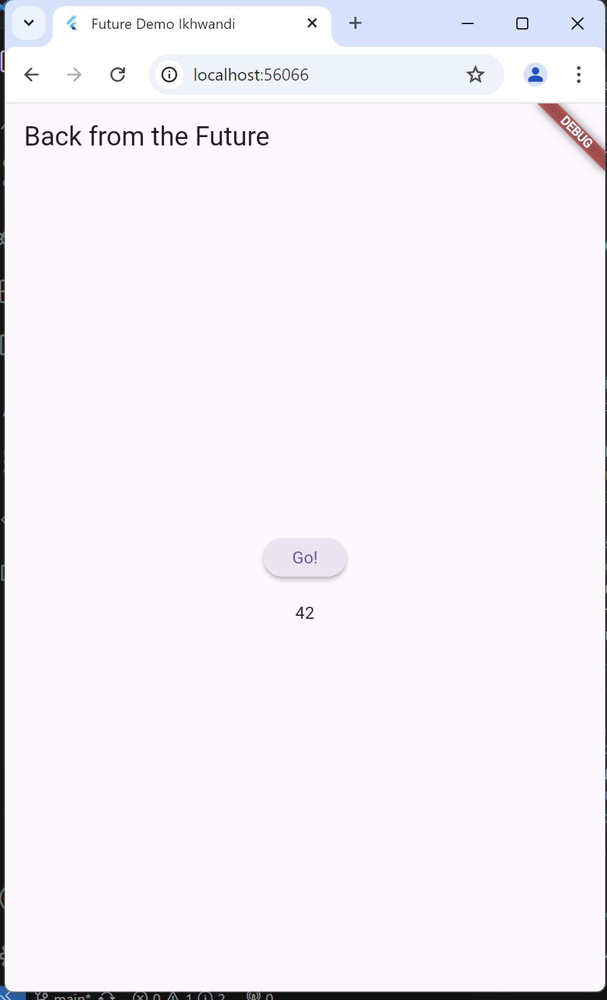
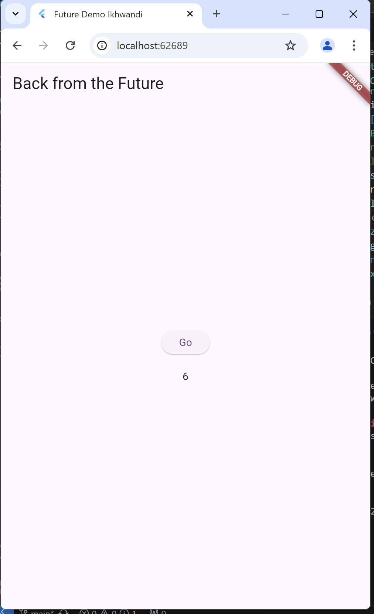
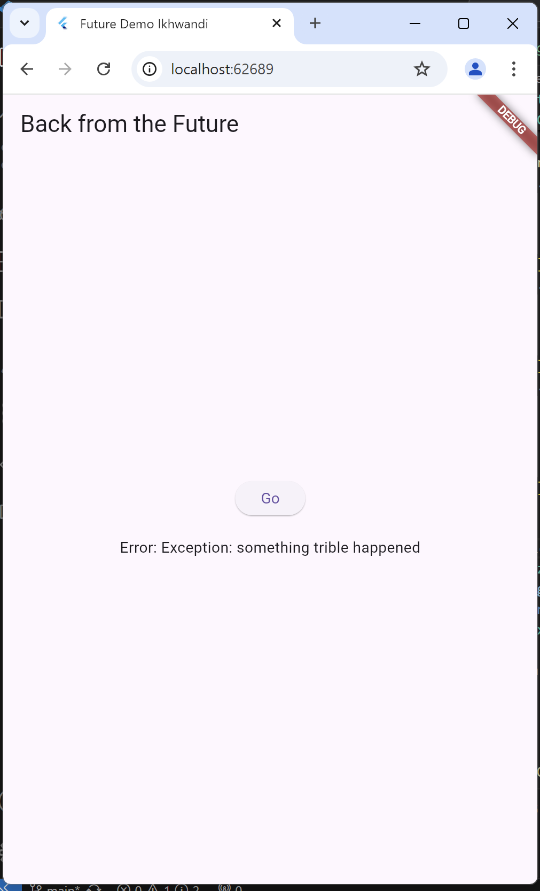

# books

A new Flutter project.

## Getting Started

Nama: Ikhwandi

Nim: 2241720028

Kelas: 3F

matkul: Pemrograman Mobile

# Praktikum 1: Mengunduh Data dari Web Service (API)

**Langkah 1: Buat Project Baru**

Buatlah sebuah project flutter baru dengan nama books di folder src week-11 repository GitHub Anda.

Kemudian Tambahkan dependensi http dengan mengetik perintah berikut di terminal.


```dart
flutter pub add http
```

**Langkah 2: Cek file pubspec.yaml**

Jika berhasil install plugin, pastikan plugin http telah ada di file pubspec ini seperti berikut.

```dart
dependencies:
  flutter:
    sdk: flutter
  http: ^1.1.0
```

**Langkah 3: Buka file main.dart**

Soal 1
Tambahkan nama panggilan Anda pada title app sebagai identitas hasil pekerjaan Anda.

```dart
class MyApp extends StatelessWidget {
  const MyApp({super.key});

  @override
  Widget build(BuildContext context) {
    return MaterialApp(
      title: 'Future Demo Ikhwandi',
      theme: ThemeData(
        primarySwatch: Colors.blue,
        visualDensity: VisualDensity.adaptivePlatformDensity,
      ),
      home: const FuturePage(),
    );
  }
}
```

**Langkah 4: Tambah method getData()**

Tambahkan method ini ke dalam class _FuturePageState yang berguna untuk mengambil data dari API Google Books.




**Langkah 5: Tambah kode di ElevatedButton**

Tambahkan kode pada onPressed di ElevatedButton seperti berikut.

Soal 3
Jelaskan maksud kode langkah 5 tersebut terkait substring dan catchError!
Capture hasil praktikum Anda berupa GIF dan lampirkan di README. Lalu lakukan commit dengan pesan "W11: Soal 3".



 # Praktikum 2: Menggunakan await/async untuk menghindari callbacks

 **Langkah 1: Buka file main.dart**

 Tambahkan tiga method berisi kode seperti berikut di dalam class _FuturePageState.

 ```dart
Future<int> returnOneAsync() async {
  await Future.delayed(const Duration(seconds: 3));
  return 1;
}

Future<int> returnTwoAsync() async {
  await Future.delayed(const Duration(seconds: 3));
  return 2;
}

Future<int> returnThreeAsync() async {
  await Future.delayed(const Duration(seconds: 3));
  return 3;
}
 ```

 Langkah 2: Tambah method count()

```dart
  Future count() async {
    int total = 0;
    total = await returnOneAsync();
    total += await returnTwoAsync();
    total += await returnThreeAsync();
    setState(() {
      result = total.toString();
    });
  }
```

**Langkah 3: Panggil count()**

Lakukan comment kode sebelumnya, ubah isi kode onPressed() menjadi seperti berikut.

```

```

**Langkah 4: Run**

Soal 4
Jelaskan maksud kode langkah 1 dan 2 tersebut!
Capture hasil praktikum Anda berupa GIF dan lampirkan di README. Lalu lakukan commit dengan pesan "W11: Soal 4".




# Praktikum 3: Menggunakan Completer di Future

**Langkah 1: Buka main.dart**

Pastikan telah impor package async berikut.

```
import 'package:async/async.dart';
```

**Langkah 2: Tambahkan variabel dan method**

Tambahkan variabel late dan method di class _FuturePageState seperti ini.

```dart
late Completer completer;

Future getNumber() {
  completer = Completer<int>();
  calculate();
  return completer.future;
}

Future calculate() async {
  await Future.delayed(const Duration(seconds : 5));
  completer.complete(42);
}
```

**Langkah 3: Ganti isi kode onPressed()**

Tambahkan kode berikut pada fungsi onPressed(). Kode sebelumnya bisa Anda comment.


**Langkah 4:**
Terakhir, run atau tekan F5 untuk melihat hasilnya jika memang belum running. Bisa juga lakukan hot restart jika aplikasi sudah running. Maka hasilnya akan seperti gambar berikut ini. Setelah 5 detik, maka angka 42 akan tampil.

Soal 5
Jelaskan maksud kode langkah 2 tersebut!
Capture hasil praktikum Anda berupa GIF dan lampirkan di README. Lalu lakukan commit dengan pesan "W11: Soal 5".




**Langkah 5: Ganti method calculate()**

Gantilah isi code method calculate() seperti kode berikut, atau Anda dapat membuat calculate2()

**Langkah 6: Pindah ke onPressed()**
Ganti menjadi kode seperti berikut.

```dart
getNumber().then((value) {
  setState(() {
    result = value.toString();
  });
}).catchError((e) {
  result = 'An error occurred';
});
```

Soal 6
Jelaskan maksud perbedaan kode langkah 2 dengan langkah 5-6 tersebut!
Capture hasil praktikum Anda berupa GIF dan lampirkan di README. Lalu lakukan commit dengan pesan "W11: Soal 6".


# Praktikum 4: Memanggil Future secara paralel

**Langkah 1: Buka file main.dart**

Tambahkan method ini ke dalam class _FuturePageState

```

```

**Langkah 2: Edit onPressed()**

Anda bisa hapus atau comment kode sebelumnya, kemudian panggil method dari langkah 1 tersebut.

```
onpresed: () {
    returnFG
}
```

**Langkah 3: Run**
Anda akan melihat hasilnya dalam 3 detik berupa angka 6 lebih cepat dibandingkan praktikum sebelumnya menunggu sampai 9 detik.


Soal 7
Capture hasil praktikum Anda berupa GIF dan lampirkan di README. Lalu lakukan commit dengan pesan "W11: Soal 7".




**Langkah 4: Ganti variabel futureGroup**

Anda dapat menggunakan FutureGroup dengan Future.wait seperti kode berikut.

```dart
final futures = Future.wait<int>([
  returnOneAsync(),
  returnTwoAsync(),
  returnThreeAsync(),
]);
```


Soal 8
Jelaskan maksud perbedaan kode langkah 1 dan 4!


# Praktikum 5: Menangani Respon Error pada Async Code

**Langkah 1: Buka file main.dart**

Tambahkan method ini ke dalam class _FuturePageState

**Langkah 2: ElevatedButton**

Ganti dengan kode berikut

**Langkah 3: Run**

Lakukan run dan klik tombol GO! maka akan menghasilkan seperti gambar berikut.

Soal 9
Capture hasil praktikum Anda berupa GIF dan lampirkan di README. Lalu lakukan commit dengan pesan "W11: Soal 9".




# Praktikum 6: Menggunakan Future dengan StatefulWidget

Langkah 1: install plugin geolocator

Langkah 2: Tambah permission GPS

Jika Anda menargetkan untuk platform Android, maka tambahkan baris kode berikut di file android/app/src/main/androidmanifest.xml

```dart
<uses-permission android:name="android.permission.ACCESS_FINE_LOCATION"/>
<uses-permission android:name="android.permission.ACCESS_COARSE_LOCATION"/>
```

Langkah 3: Buat file geolocation.dart

Langkah 4: Buat StatefulWidget
Buat class LocationScreen di dalam file geolocation.dart

Langkah 5: Isi kode geolocation.dart


Langkah 6: Edit main.dart

Panggil screen baru tersebut di file main Anda seperti berikut.

```dart
home: LocationScreen(),
```

Langkah 7: Run

Run project Anda di device atau emulator (bukan browser), maka akan tampil seperti berikut ini.

Langkah 8: Tambahkan animasi loading


Soal 12
Jika Anda tidak melihat animasi loading tampil, kemungkinan itu berjalan sangat cepat. Tambahkan delay pada method getPosition() dengan kode await Future.delayed(const Duration(seconds: 3));
Apakah Anda mendapatkan koordinat GPS ketika run di browser? Mengapa demikian?
Capture hasil praktikum Anda berupa GIF dan lampirkan di README. Lalu lakukan commit dengan pesan "W11: Soal 12".


# Praktikum 7: Manajemen Future dengan FutureBuilder

Langkah 1: Modifikasi method getPosition()

Buka file geolocation.dart kemudian ganti isi method dengan kode ini.

Langkah 2: Tambah variabel

Tambah variabel ini di class _LocationScreenState

Langkah 3: Tambah initState()

Tambah method ini dan set variabel position

Langkah 4: Edit method build()

Ketik kode berikut dan sesuaikan. Kode lama bisa Anda comment atau hapus.

Soal 13
Apakah ada perbedaan UI dengan praktikum sebelumnya? Mengapa demikian?
Capture hasil praktikum Anda berupa GIF dan lampirkan di README. Lalu lakukan commit dengan pesan "W11: Soal 13".
Seperti yang Anda lihat, menggunakan FutureBuilder lebih efisien, clean, dan reactive dengan Future bersama UI.


Langkah 5: Tambah handling error

Tambahkan kode berikut untuk menangani ketika terjadi error. Kemudian hot restart.
```dart
else if (snapshot.connectionState == ConnectionState.done) {
  if (snapshot.hasError) {
     return Text('Something terrible happened!');
  }
  return Text(snapshot.data.toString());
}
```

Soal 14
Apakah ada perbedaan UI dengan langkah sebelumnya? Mengapa demikian?
Capture hasil praktikum Anda berupa GIF dan lampirkan di README. Lalu lakukan commit dengan pesan "W11: Soal 14".


# Praktikum 8: Navigation route dengan Future Function

Langkah 1: Buat file baru navigation_first.dart

Buatlah file baru ini di project lib Anda.

Langkah 2: Isi kode navigation_first.dart

Soal 15
Tambahkan nama panggilan Anda pada tiap properti title sebagai identitas pekerjaan Anda.
Silakan ganti dengan warna tema favorit Anda.

Langkah 3: Tambah method di class _NavigationFirstState

Tambahkan method ini.

```dart
Future _navigateAndGetColor(BuildContext context) async {
   color = await Navigator.push(context,
        MaterialPageRoute(builder: (context) => const NavigationSecond()),) ?? Colors.blue;
   setState(() {});
   });
}
```

Langkah 4: Buat file baru navigation_second.dart

Buat file baru ini di project lib Anda. Silakan jika ingin mengelompokkan view menjadi satu folder dan sesuaikan impor yang dibutuhkan.


Langkah 5: Buat class NavigationSecond dengan StatefulWidget

Langkah 6: Edit main.dart

Lakukan edit properti home.

```dart
home: const NavigationFirst(),
```

Langkah 8: Run

Lakukan run, jika terjadi error silakan diperbaiki.

Soal 16
Cobalah klik setiap button, apa yang terjadi ? Mengapa demikian ?
Gantilah 3 warna pada langkah 5 dengan warna favorit Anda!
Capture hasil praktikum Anda berupa GIF dan lampirkan di README. Lalu lakukan commit dengan pesan "W11: Soal 16".


# Praktikum 9: Memanfaatkan async/await dengan Widget Dialog

Langkah 1: Buat file baru navigation_dialog.dart

Buat file dart baru di folder lib project Anda.

Langkah 2: Isi kode navigation_dialog.dart

Langkah 3: Tambah method async

Langkah 4: Panggil method di ElevatedButton

Langkah 5: Edit main.dart

Ubah properti home

Langkah 6: Run

Coba ganti warna background dengan widget dialog tersebut. Jika terjadi error, silakan diperbaiki. Jika berhasil, akan tampil seperti gambar berikut.

Soal 17
Cobalah klik setiap button, apa yang terjadi ? Mengapa demikian ?
Gantilah 3 warna pada langkah 3 dengan warna favorit Anda!
Capture hasil praktikum Anda berupa GIF dan lampirkan di README. Lalu lakukan commit dengan pesan "W11: Soal 17".
