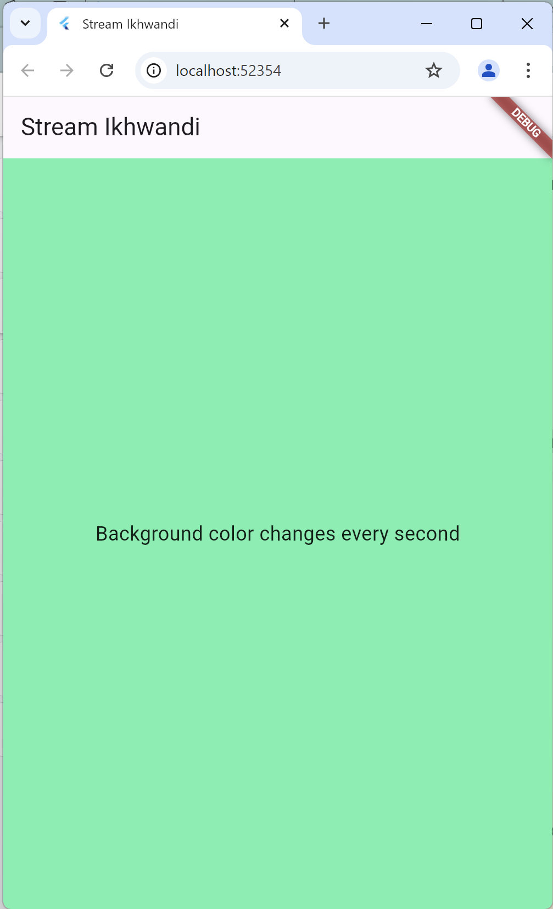
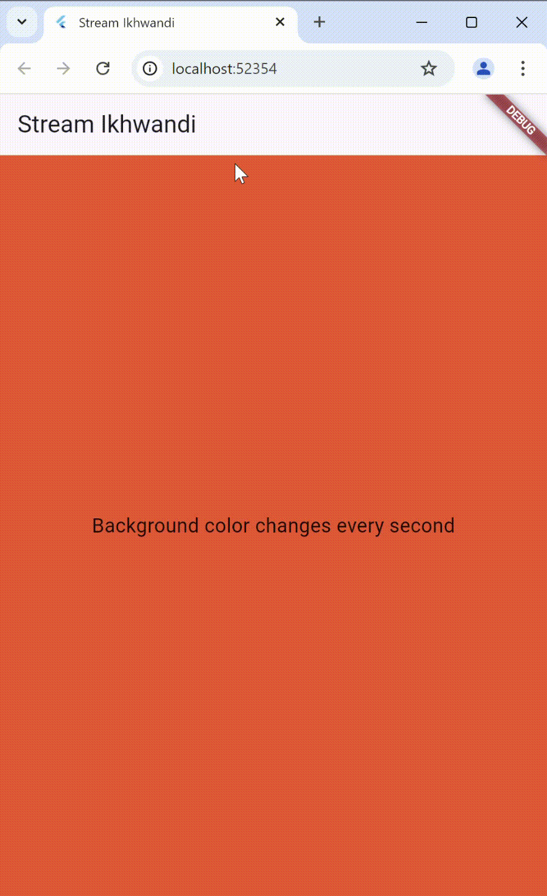

# stream_iwan

A new Flutter project.

## Getting Started

# Praktikum 1: Dart Streams

**Langkah 1: Buat Project Baru**

**Langkah 2: Buka file main.dart**

Soal 1
Tambahkan nama panggilan Anda pada title app sebagai identitas hasil pekerjaan Anda.
Gantilah warna tema aplikasi sesuai kesukaan Anda.
Lakukan commit hasil jawaban Soal 1 dengan pesan "W12: Jawaban Soal 1"

**Langkah 3: Buat file baru stream.dart**

**Langkah 4: Tambah variabel colors**

Soal 2
Tambahkan 5 warna lainnya sesuai keinginan Anda pada variabel colors tersebut.
Lakukan commit hasil jawaban Soal 2 dengan pesan "W12: Jawaban Soal 2"
**Langkah 5: Tambah method getColors()**

**Langkah 6: Tambah perintah yield**
```dart
yield* Stream.periodic(
  const Duration(seconds: 1), (int t) {
    int index = t % colors.length;
    return colors[index];
});
```
Soal 3
Jelaskan fungsi keyword yield* pada kode tersebut!
Apa maksud isi perintah kode tersebut?
Lakukan commit hasil jawaban Soal 3 dengan pesan "W12: Jawaban Soal 3"
**Langkah 7: Buka main.dart**

**Langkah 8: Tambah variabel**

**Langkah 9: Tambah method changeColor()**

**Langkah 10: Lakukan override initState()**

**Langkah 11: Ubah isi Scaffold()**

**Langkah 12: Run**

hasil





**Langkah 13: Ganti isi method changeColor()**

Soal 5
Jelaskan perbedaan menggunakan listen dan await for (langkah 9) !
Lakukan commit hasil jawaban Soal 5 dengan pesan "W12: Jawaban Soal 5"


# Praktikum 2: Stream controllers dan sinks

**Langkah 1: Buka file stream.dart**

**Langkah 2: Tambah class NumberStream**

**Langkah 3: Tambah StreamController**

**Langkah 4: Tambah method addNumberToSink**

**Langkah 5: Tambah method close()**

**Langkah 5: Tambah method close()**

**Langkah 7: Tambah variabel**

**Langkah 8: Edit initState()**

**Langkah 9: Edit dispose()**

**Langkah 10: Tambah method addRandomNumber()**

**Langkah 11: Edit method build()**

**Langkah 12: Run**\
Soal 6
Jelaskan maksud kode langkah 8 dan 10 tersebut!
Capture hasil praktikum Anda berupa GIF dan lampirkan di README.
Lalu lakukan commit dengan pesan "W12: Jawaban Soal 6".

**Langkah 13: Buka stream.dart**

**Langkah 13: Buka stream.dart**

**Langkah 13: Buka stream.dart**

Soal 7
Jelaskan maksud kode langkah 13 sampai 15 tersebut!
Kembalikan kode seperti semula pada Langkah 15, comment addError() agar Anda dapat melanjutkan ke praktikum 3 berikutnya.
Lalu lakukan commit dengan pesan "W12: Jawaban Soal 7".

# Praktikum 3: Injeksi data ke streams

**Langkah 1: Buka main.dart**

**Langkah 2: Tambahkan kode ini di initState**
**Langkah 3: Tetap di initState**
**Langkah 4: Run**

Soal 8
Jelaskan maksud kode langkah 1-3 tersebut!
Capture hasil praktikum Anda berupa GIF dan lampirkan di README.
Lalu lakukan commit dengan pesan "W12: Jawaban Soal 8".

# Praktikum 4: Subscribe ke stream events

**Langkah 1: Tambah variabel**

**Langkah 2: Edit initState()**

**Langkah 3: Tetap di initState()**

**Langkah 4: Tambah properti onDone()**

**Langkah 5: Tambah method baru**

**Langkah 6: Pindah ke method dispose()**

**Langkah 7: Pindah ke method build()**

**Langkah 8: Edit method addRandomNumber()**

**Langkah 9: Run**

**Langkah 10: Tekan button ‘Stop Subscription'**


Soal 9
Jelaskan maksud kode langkah 2, 6 dan 8 tersebut!
Capture hasil praktikum Anda berupa GIF dan lampirkan di README.
Lalu lakukan commit dengan pesan "W12: Jawaban Soal 9".

# Praktikum 5: Multiple stream subscriptions
