# Praktikum 1: Eksperimen Tipe Data List

Selesaikan langkah-langkah praktikum berikut ini menggunakan VS Code atau Code Editor favorit Anda.

*Langkah 1:*

Ketik atau salin kode program berikut ke dalam void main().

*Langkah 2:*

Silakan coba eksekusi (Run) kode pada langkah 1 tersebut. Apa yang terjadi? Jelaskan!

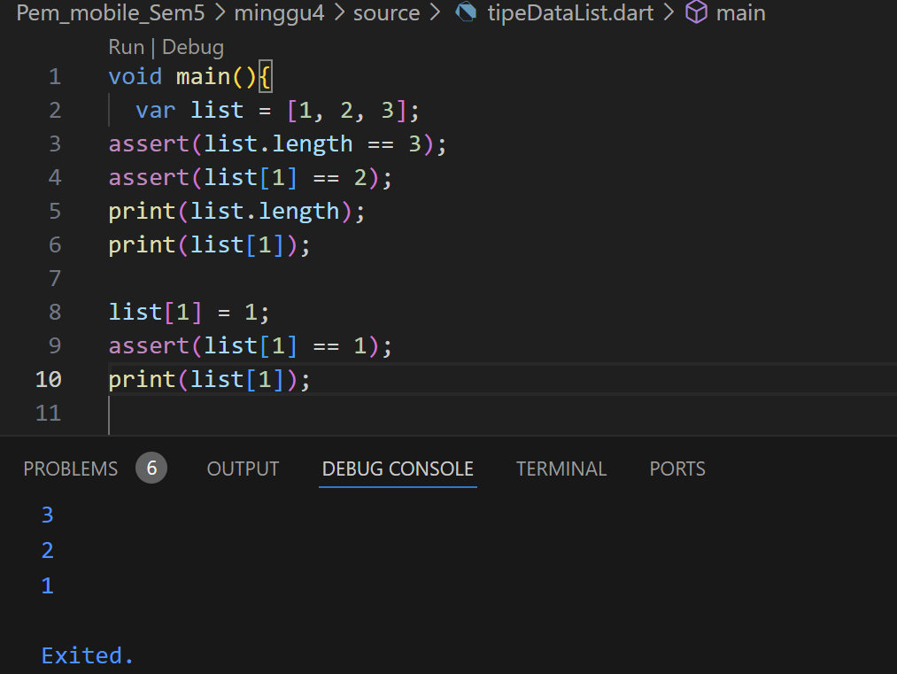

*Langkah 3:*

Ubah kode pada langkah 1 menjadi variabel final yang mempunyai index = 5 dengan default value = null. Isilah nama dan NIM Anda pada elemen index ke-1 dan ke-2. Lalu print dan capture hasilnya.

Apa yang terjadi ? Jika terjadi error, silakan perbaiki.

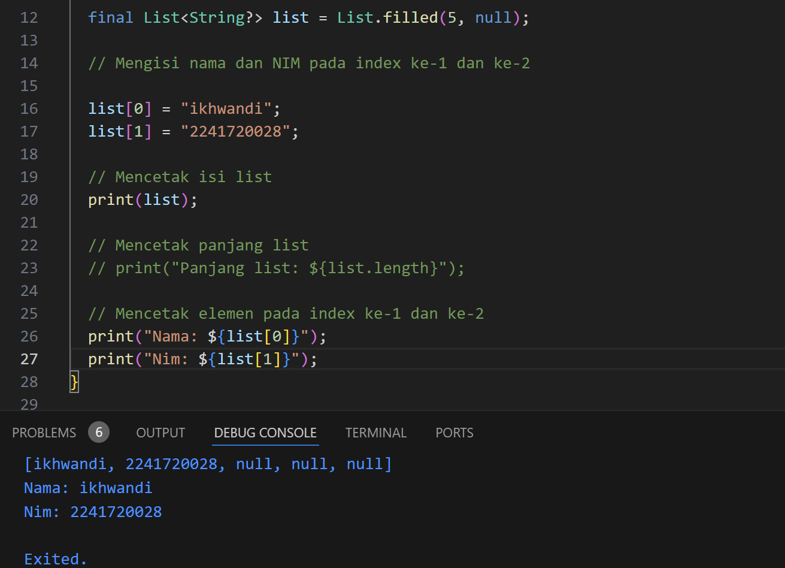

# Praktikum 2: Eksperimen Tipe Data List

Selesaikan langkah-langkah praktikum berikut ini menggunakan VS Code atau Code Editor favorit Anda.

*Langkah 1:*

Ketik atau salin kode program berikut ke dalam fungsi main().

*Langkah 2:*

Silakan coba eksekusi (Run) kode pada langkah 1 tersebut. Apa yang terjadi? Jelaskan! Lalu perbaiki jika terjadi error.

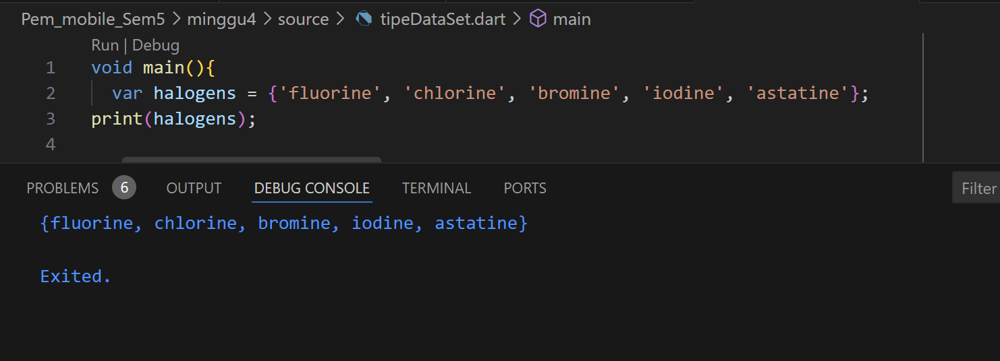

*Langkah 3:*

Tambahkan kode program berikut, lalu coba eksekusi (Run) kode Anda.

Apa yang terjadi ? Jika terjadi error, silakan perbaiki namun tetap menggunakan ketiga variabel tersebut. Tambahkan elemen nama dan NIM Anda pada kedua variabel Set tersebut dengan dua fungsi berbeda yaitu .add() dan .addAll(). Untuk variabel Map dihapus, nanti kita coba di praktikum selanjutnya.

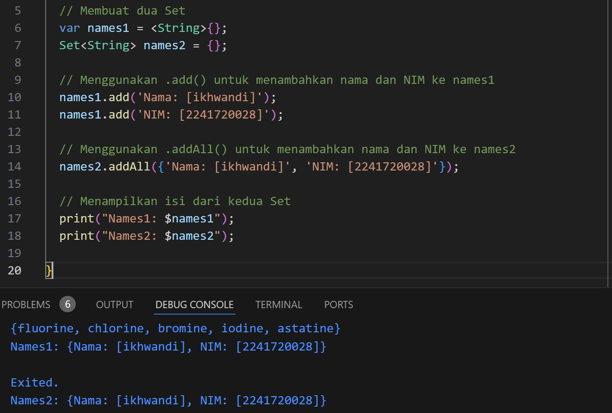

# Praktikum 3: Eksperimen Tipe Data Maps

Selesaikan langkah-langkah praktikum berikut ini menggunakan VS Code atau Code Editor favorit Anda.

*Langkah 1:*

Ketik atau salin kode program berikut ke dalam fungsi main().

*Langkah 2:*

Silakan coba eksekusi (Run) kode pada langkah 1 tersebut. Apa yang terjadi? Jelaskan! Lalu perbaiki jika terjadi error.

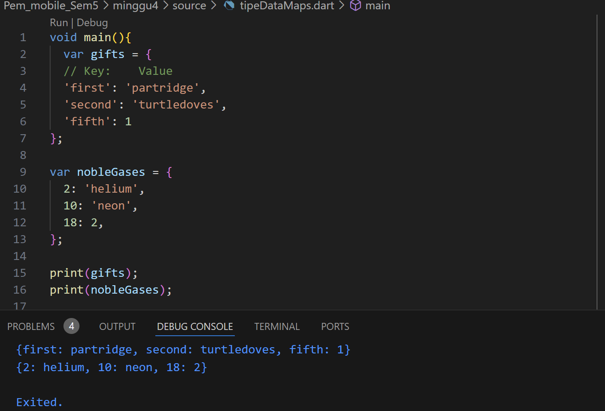

*Langkah 3:*

Tambahkan kode program berikut, lalu coba eksekusi (Run) kode Anda.

Apa yang terjadi ? Jika terjadi error, silakan perbaiki.

Tambahkan elemen nama dan NIM Anda pada tiap variabel di atas (gifts, nobleGases, mhs1, dan mhs2). Dokumentasikan hasilnya dan buat laporannya!

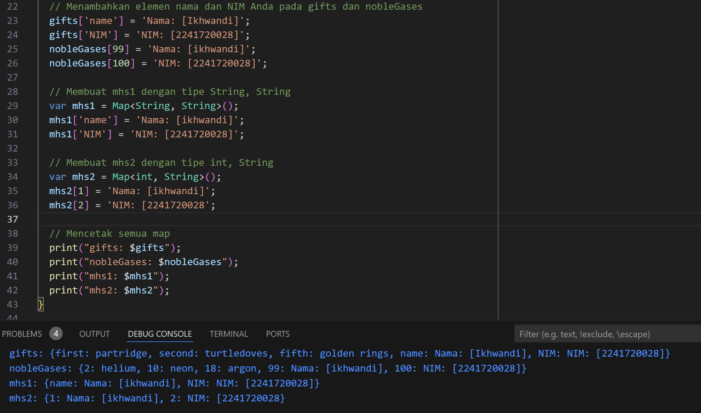

# Praktikum 4: Eksperimen Tipe Data List: Spread dan Control-flow Operators

Selesaikan langkah-langkah praktikum berikut ini menggunakan VS Code atau Code Editor favorit Anda.

*Langkah 1:*

Ketik atau salin kode program berikut ke dalam fungsi main().

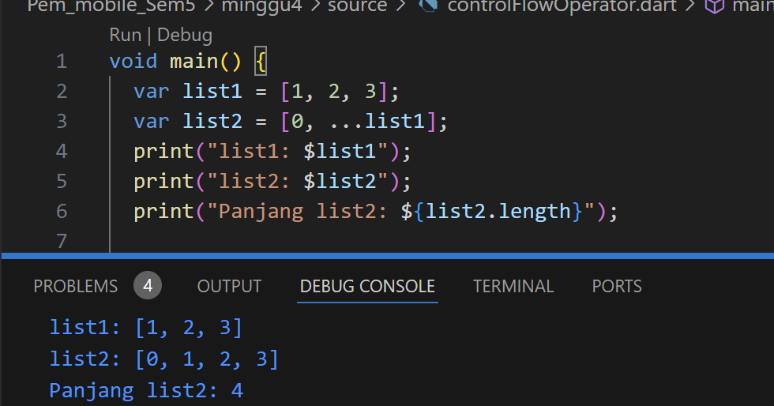

*Langkah 2:*

Silakan coba eksekusi (Run) kode pada langkah 1 tersebut. Apa yang terjadi? Jelaskan! Lalu perbaiki jika terjadi error.

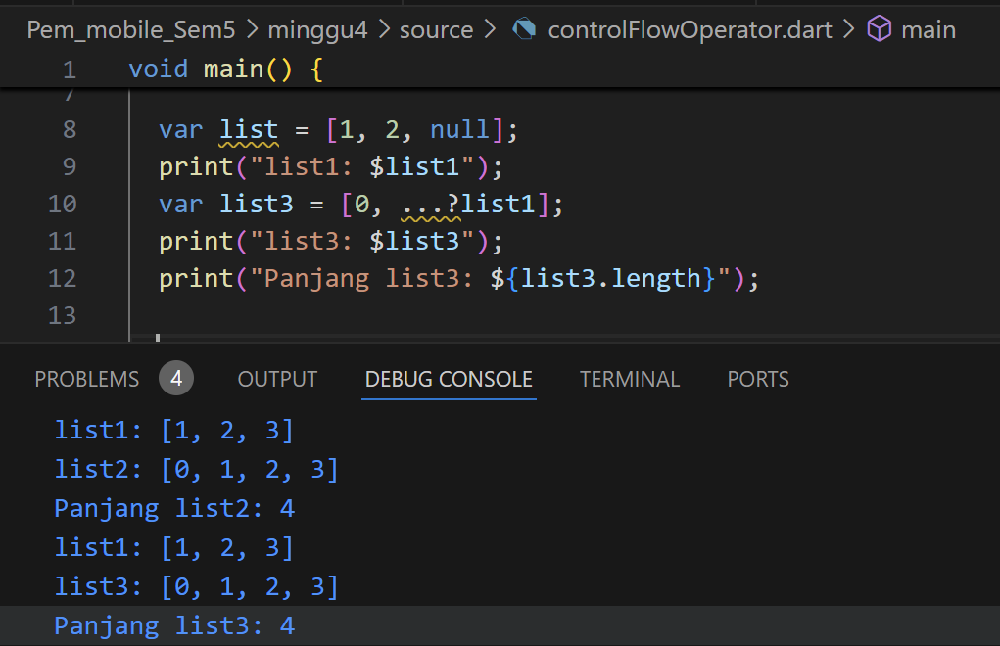

*Langkah 3:*

Tambahkan kode program berikut, lalu coba eksekusi (Run) kode Anda.

Apa yang terjadi ? Jika terjadi error, silakan perbaiki.

Tambahkan variabel list berisi NIM Anda menggunakan Spread Operators. Dokumentasikan hasilnya dan buat laporannya!

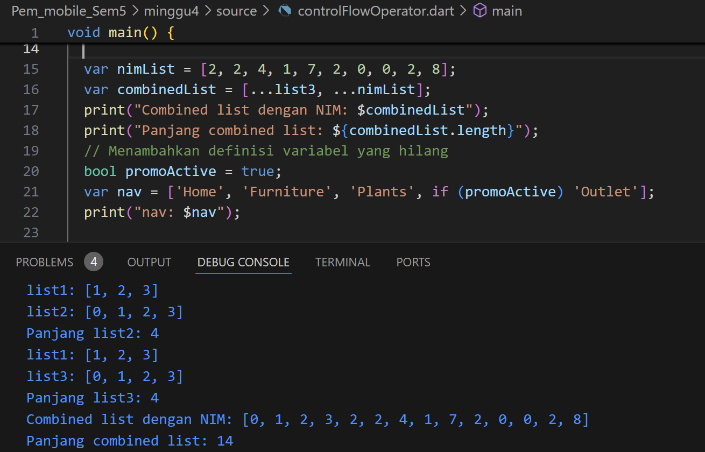

*Langkah 4:*

Tambahkan kode program berikut, lalu coba eksekusi (Run) kode Anda.

Apa yang terjadi ? Jika terjadi error, silakan perbaiki. Tunjukkan hasilnya jika variabel promoActive ketika true dan false.

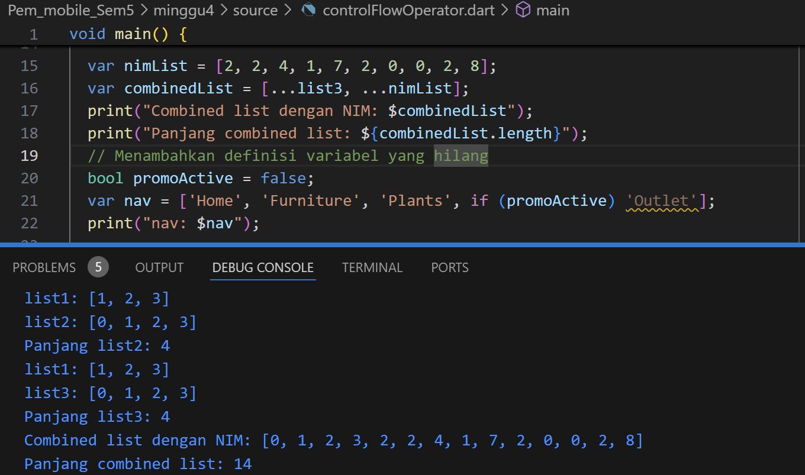

*Langkah 5:*

Tambahkan kode program berikut, lalu coba eksekusi (Run) kode Anda.

Apa yang terjadi ? Jika terjadi error, silakan perbaiki. Tunjukkan hasilnya jika variabel login mempunyai kondisi lain.

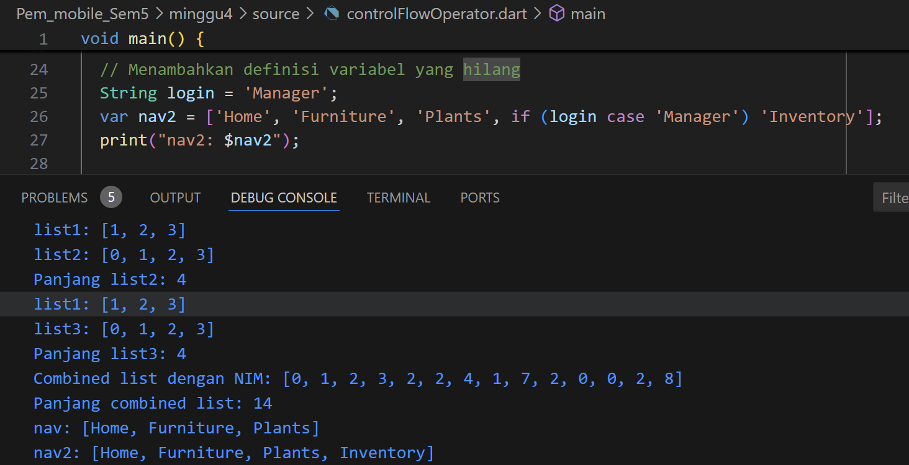

login as admin

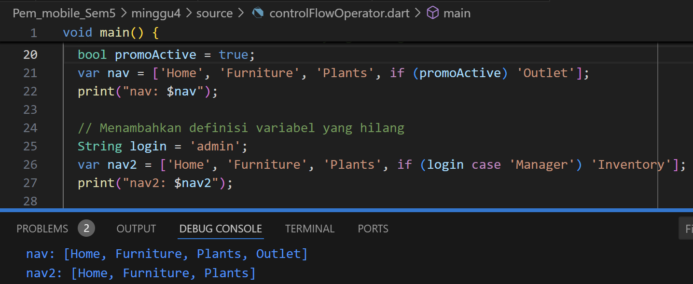

*Langkah 6:*

Tambahkan kode program berikut, lalu coba eksekusi (Run) kode Anda.

Apa yang terjadi ? Jika terjadi error, silakan perbaiki. Jelaskan manfaat Collection For dan dokumentasikan hasilnya.

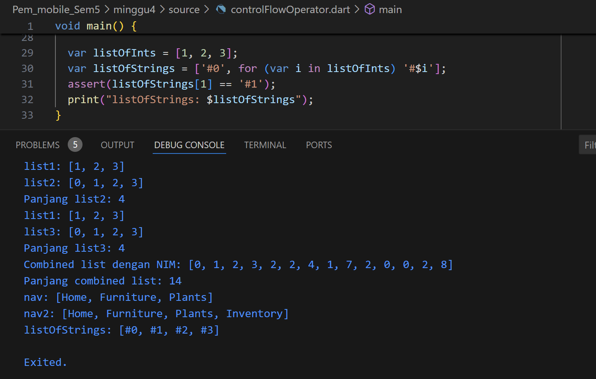

Collection for dalam Dart adalah fitur yang mempermudah pengisian koleksi seperti List, Set, atau Map dengan menggunakan perulangan for. Ini berguna untuk menyederhanakan kode saat Anda ingin membangun atau mengisi koleksi berdasarkan kondisi atau iterasi. Manfaat utama dari Collection for adalah membuat kode lebih ringkas, mudah dibaca, dan efisien.

# Praktikum 5: Eksperimen Tipe Data List: Spread dan Control-flow Operators

Selesaikan langkah-langkah praktikum berikut ini menggunakan VS Code atau Code Editor favorit Anda.

*Langkah 1:*

Ketik atau salin kode program berikut ke dalam fungsi main().

*Langkah 2:*

Silakan coba eksekusi (Run) kode pada langkah 1 tersebut. Apa yang terjadi? Jelaskan! Lalu perbaiki jika terjadi error.

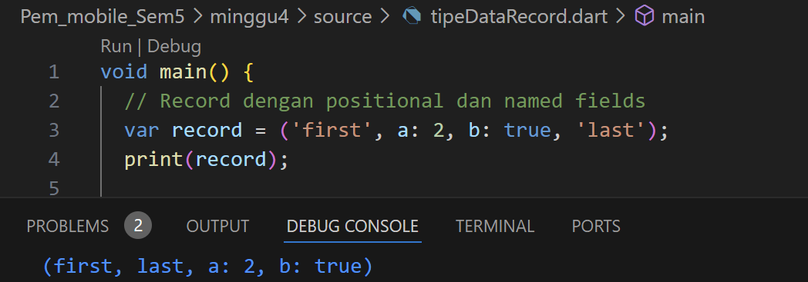

*Langkah 3:*

Tambahkan kode program berikut di luar scope void main(), lalu coba eksekusi (Run) kode Anda.

Apa yang terjadi ? Jika terjadi error, silakan perbaiki. Gunakan fungsi tukar() di dalam main() sehingga tampak jelas proses pertukaran value field di dalam Records.

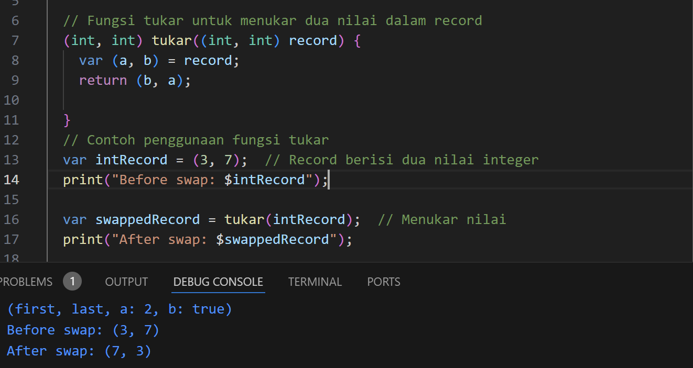

*Langkah 4:*

Tambahkan kode program berikut di dalam scope void main(), lalu coba eksekusi (Run) kode Anda.

Apa yang terjadi ? Jika terjadi error, silakan perbaiki. Inisialisasi field nama dan NIM Anda pada variabel record mahasiswa di atas. Dokumentasikan hasilnya dan buat laporannya!

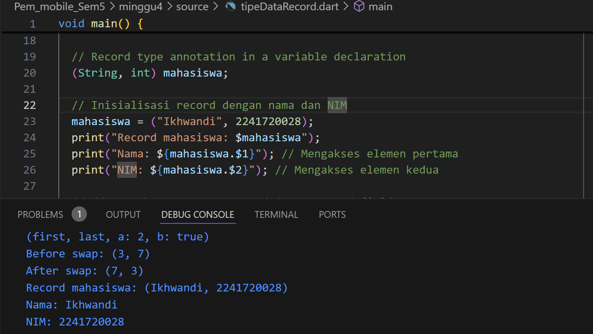

*Langkah 5:*

Tambahkan kode program berikut di dalam scope void main(), lalu coba eksekusi (Run) kode Anda.

Apa yang terjadi ? Jika terjadi error, silakan perbaiki. Gantilah salah satu isi record dengan nama dan NIM Anda, lalu dokumentasikan hasilnya dan buat laporannya!

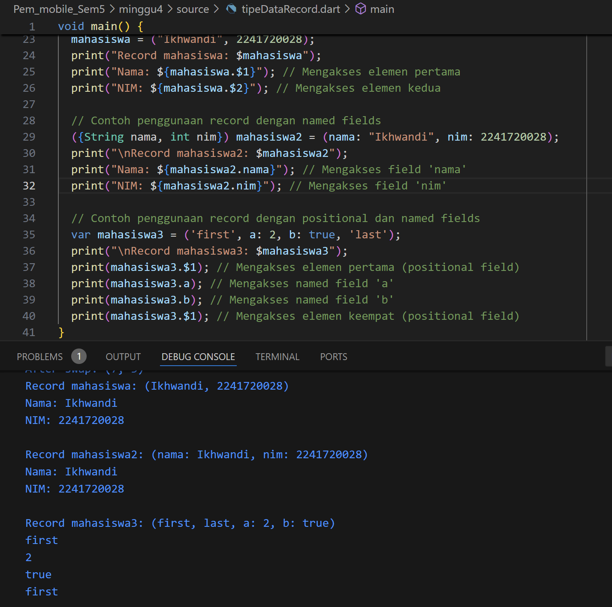

# tugas praktikum 

1. Silakan selesaikan Praktikum 1 sampai 5, lalu dokumentasikan berupa screenshot hasil pekerjaan Anda beserta penjelasannya!
2. Jelaskan yang dimaksud Functions dalam bahasa Dart!

jawab: Functions di Dart adalah blok kode yang dapat dipanggil untuk melakukan tugas tertentu. Mereka memungkinkan kita untuk mengorganisir kode, membuatnya lebih mudah dibaca, dan menghindari pengulangan.

3. Jelaskan jenis-jenis parameter di Functions beserta contoh sintaksnya!

jawab: 

a. Required parameters:

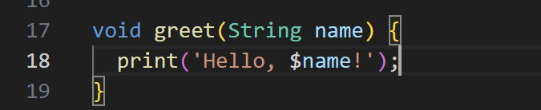

b. Optional positional parameters:

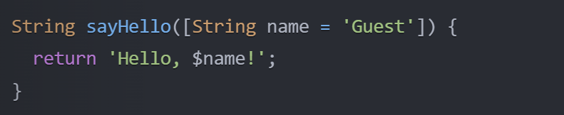

c. Named parameters:

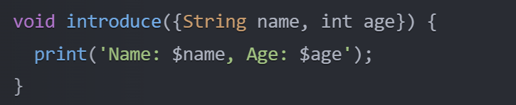

d. Required named parameters:

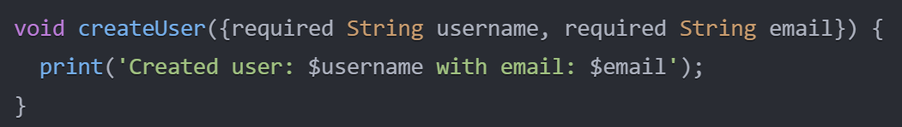

4. Jelaskan maksud Functions sebagai first-class objects beserta contoh sintaknya!

jawab:

Dalam Dart, functions dianggap sebagai objek first-class. Ini berarti functions dapat:

* Disimpan dalam variabel
* Dilewatkan sebagai argumen ke functions lain
* Dikembalikan dari functions lain

contoh:

5. Apa itu Anonymous Functions? Jelaskan dan berikan contohnya!

jawab: 

Anonymous functions (atau lambda functions) adalah functions tanpa nama. Mereka sering digunakan untuk operasi singkat.

contoh:
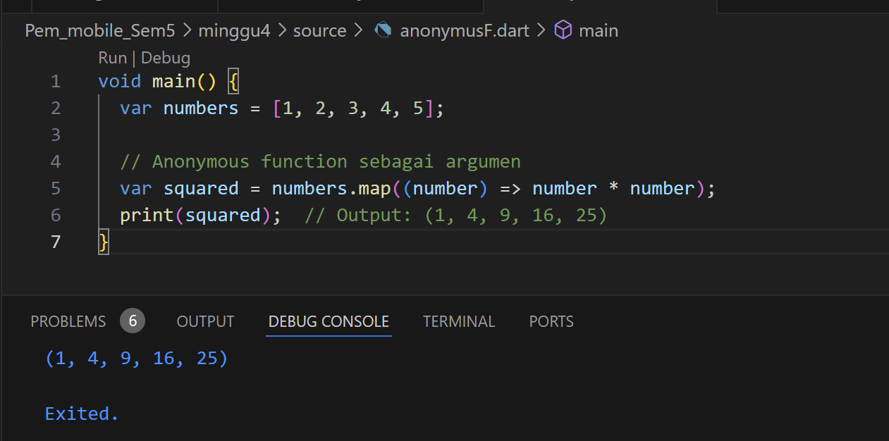

6. Jelaskan perbedaan Lexical scope dan Lexical closures! Berikan contohnya!

jawab:
* Lexical scope: Variabel hanya dapat diakses dalam blok kode di mana mereka didefinisikan.
* Lexical closures: Function dapat mengakses variabel dari scope di mana function tersebut didefinisikan.

contoh:
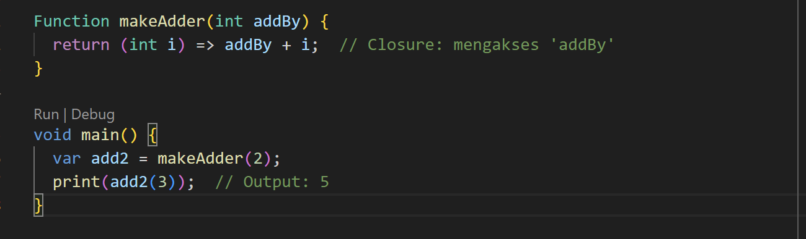
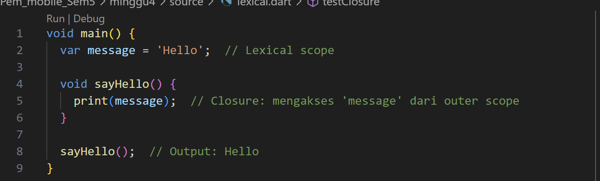

7. Jelaskan dengan contoh cara membuat return multiple value di Functions!

jawab:
Dart tidak memiliki built-in support untuk mengembalikan multiple values, tetapi kita bisa menggunakan beberapa teknik:

a. Menggunakan List:

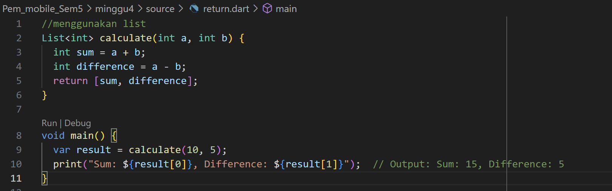

b. Menggunakan Map:

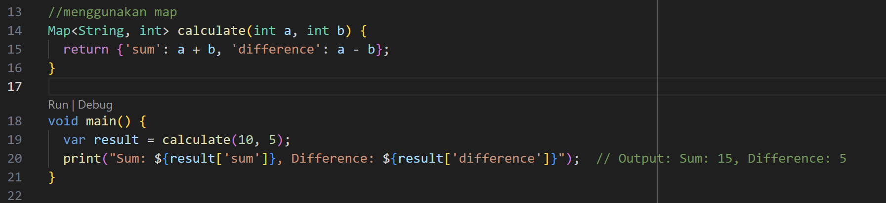

c. Menggunakan custom class:

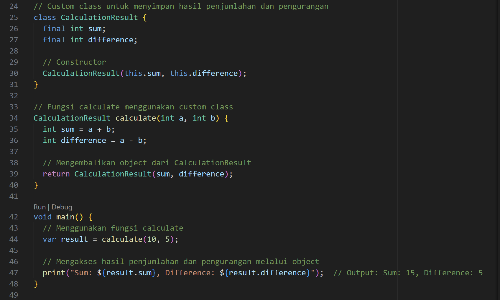

Kumpulkan berupa link commit repo GitHub pada tautan yang telah disediakan di grup Telegram!

