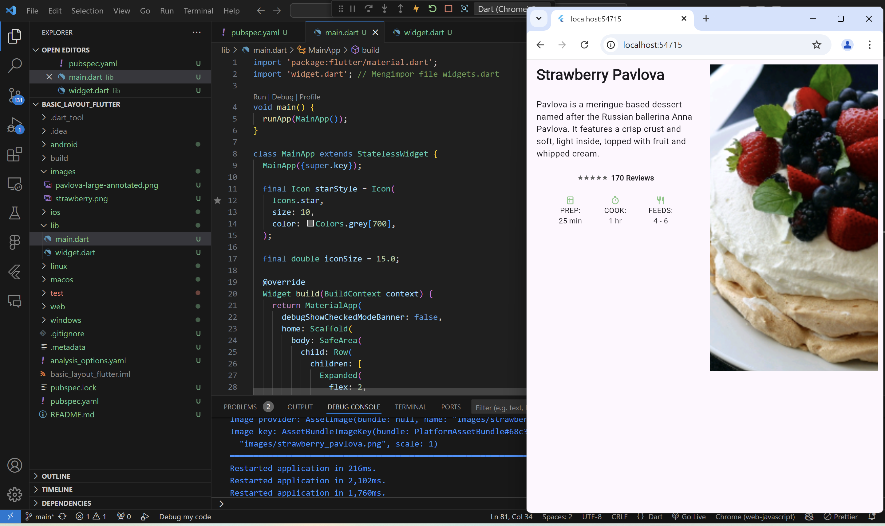

# basic_layout_flutter

A new Flutter project.

## Getting Started

# nama: ikwhandi
# nim : 2241720028
# kelas : 3F
# matkul : pemrograman mobile

Silakan implementasikan di project baru "basic_layout_flutter" dengan mengakses sumber ini: https://docs.flutter.dev/codelabs/layout-basics

# Layouts in Flutter

hasil yang diharapkan :

hasil percobaan:

